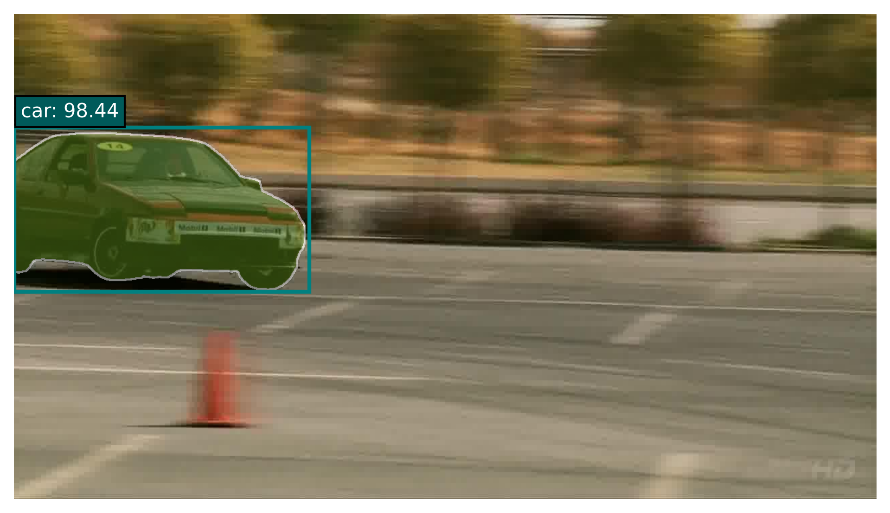

# YOLO-SAM2
**Cascade YOLOv8 and SAM2 to predict the corresponding objects based on the YOLOv8 detection boxes to get the labelled object masks.**

| Car                      | Airplane                           | Elephant                           | Turtle                         | Watercraft                             |
|--------------------------|------------------------------------|------------------------------------|--------------------------------|----------------------------------------|
|  |  |  |  |  |
<div style="text-align: center;">Table. 1. Visual on the ImageNet dataset.</div>

## Introduction
Since [Segment Anything Model 2 (SAM 2)](https://github.com/facebookresearch/sam2) is a foundation model for solving promptable visual segmentation in images and videos, the segmentation results are instances (objects) without category, so we combine [YOLOv8](https://github.com/Pertical/YOLOv8) and SAM2 to obtain the object segmentation mask with category labeling. Based on the lightweight and fast detection characteristics of YOLOv8, we use the detection frame generated by YOLOv8 as a prompt for the segmentation of the SAM2 model to guide the SAM2 model to segment the objects in the detection frame and finally output the segmentation mask with labels. This repository can generate visualization results and labelme format target mask annotation files, which can be used for target segmentation in real scenarios and as an automated data annotation tool. At the same time, we implement a semantic segmentation evaluation metric to evaluate the effect of segmentation, and the results show that it has a good semantic segmentation effect.

[//]: # (由于SAM2属于提示型目标分割模型，分割结果的是不带类别的实例（对象），因此我们结合YOLOv8和SAM2, 以获得类别标注的目标分割掩码。基于YOLOv8轻量快速检测的特性，利用YOLOv8生成的检测框，作为SAM2模型分割的提示，指导SAM2模型分割检测框中的目标，最终输出带标签的分割掩码。本仓库可以生成可视化结果和labelme格式的目标掩码标注文件，既可以用于真实场景的目标分割，又可以作为数据自动化标注工具。同时，我们实现语义分割的评估指标来评估分割的效果, 结果表明具有不错的语义分割效果。)

## Quick Start
### installation
Install YOLO-SAM2 from source.
```shell
git clone git@github.com:KaiHongLi/YOLO-SAM2.git
cd YOLO_SAM2
```

Create conda env.
```shell
conda create -n yolo-sam2 python=3.12.9
conda activate yolo-sam2
pip install -r requirements.txt
```

Install SAM2-1.0
```shell
git clone git@github.com:facebookresearch/sam2.git
cd sam2
pip install -e .
```

### DataSets Format
Download your dataset convert to Pascal Voc Segmentation formate for YOLO-SAM2 and organize it as follows:
```txt
path to your datasets/dataset/ImageSets/Segmentation/ 
                                        —— val.txt(Image filenames)
                                        —— val_videos.txt(Video dirnames)
path to your datasets/dataset/JPEGImages
                              —— aaa.jp
                              —— bbb.jpg
path to your datasets/dataset/SegmentationClass
                              —— aaa.png(Binary index map)
                              —— bbb.png
```

### Finetune on Your Datasets
Finetune the YOLO and SAM2 models with your dataset, and then place the fine-tuned model weights in the corresponding folders.
```shell
yolo: ./yolo/yolov8/yolov8x.pt
sam2: ./sam/sam2.1/sam2.1_hiera_l.pt
```

### Cascade YOLO and SAM2

**Evaluation:**
```shell
python yolo_sam.py -c config.json -b 16 -conf 0.25 -p ./yolo/yolov8/prediction.json
# -c stands for the configuration file
# -b stands for the batch_size of the dataloader
# -conf stands for the threshold of the YOLO detection boxes confidence
# -p stands for the prompt file(default set to None)
```
If you want to accelerate the segmentation speed or have a limited GPU source, you can get the YOLO prediction file first and place it in the corresponding folders. The code can directly read the prompts for the SAM2.
- YOLO prediction file format
```json
[
  {
    "image_id": "23960", 
    "category_id": 3, 
    "bbox": [762.501, 302.91, 985.594, 512.487], 
    "score": 0.9004
  },
  { }
]
```

**Visualization:**

```shell
python yolo_sam_visual.py -c config.json -b 16 -conf 0.25 -p ./yolo/yolov8/prediction.json
# -c stands for the configuration file
# -b stands for the batch_size of the dataloader
# -conf stands for the threshold of the YOLO detection boxes confidence
# -p stands for the prompt file(default set to None)
```

**Automated annotation Generate:**
```shell
python yolo_sam_auto_anno_generator.py -c config.json -b 16 -conf 0.25 -p ./yolo/yolov8/prediction.json
# -c stands for the configuration file
# -b stands for the batch_size of the dataloader
# -conf stands for the threshold of the YOLO detection boxes confidence
# -p stands for the prompt file(default set to None)
```

## Main Result 
**Evaluation Result**
```txt
    Pixel_Accuracy:
    Mean_IOU:
    Class_IOU: 0:   1:   2:  ...
```
**Visualization Result**


<div style="text-align: center;">Fig. 1. Visual on the ImageNet dataset.</div>

**Auto Annotation Result**
```json
{
    "version": "5.5.0",
    "flags": {},
    "shapes": [
        {
            "label": "elephant",
            "points": [
                [
                    36,
                    74
                ],
                [
                    437,
                    273
                ]
            ],
            "group_id": null,
            "description": "",
            "shape_type": "mask",
            "flags": {},
            "mask": "iVBORw0KGgoAAAANSUhEUgAAAZIAAADICAAAAADnizgDAAAGRElEQVR4nO2d0ZqjIAxGw37z/q/sXrS1WkEDJOSH5Fzs7szO1IRjglK1iVyTLt/ZDKI4c43JBzd5W0vxqISRs6UWX0qqsq3RkgQt/pN6oRmo2/8q99ZERJRS/z7uqUqqc7VpX06UNKZZ5SRt+4a6XK6vpDPDutHdN9YhZRUlh/k1bfuXItkxRjd9N171e4UXmx79FB4HN1F+F2iyMreSsdFzBvgUUVudzKvELPLrQKf9WwJ9a04lCEFv+6R18wPHL9ggZMcDKNL3ADMXZtLhVzgAJVoGL8jb+jj+FB1PVXjLLnjZXpggxBLbNfhnJ1PkO0WQPBhVMsWyo/U7GIIw9q4plCxUJYxcplDiiwl2wAlCrOKpDUeVwIGvZLUieUwIPmH4AFu47V3YGWNH18z9bIKbNG5kMhS9YCaOGZU0BSlwycMFpEjeyd/gKO7x5KMIkJLw8QJjHDCiGE+2cwFUiVcfb9KvF+PxcK7jxY8TyzEJH0R07V6Ga1xh5MXvOJiNSwj5cq4To5EJISdOTmwaVxg5k4pfWAQQENGpToYPT/jI83UyeIRCSJHdydCz9xDCYdwohY8HMjdyaRI+GPAvyO8nhPB4ORkwl4SQOnTHK2zUsRGpVkn4aENt3EJICxvprXGFkSYSaTWuENKBSpWEkWaSjpIw0oWCkjDSh/hcEkJ6wb/lxx3SSqJIOknCjSuECBCNC45QAoeokuhbEogqWehZJ4bINq5wIoBCr4n21YfS+IWWZjalI64tWlgzcRAMRyiBQ01JdK5W9KoknDSi2LjCSRuac0kcdjWhO72Hk2oyT3sWJ84aqxih5EvIYbANPS+JNsZi6KliOHlkG332Hk4YxIIKFJpXzt9sMrgnng6BxEZkNzyhJYepkjdh5gSCEogIcABRQiBBAHD8hDkAYAIxBEwJYcViAp4StGhGM/IZKjXABTSOtxK4BZU4v4dTEm8PY/YJzKiUGfyItGpQ49Jjbw64qeNGpsK3XePNJR/cTim4Snw5OSQLrMSXky/IShw5OWYKrcQNAJ/MEJw4d4NQYs9Pfw4l5gB9FtYzLs4WL8cw0Ep8EkqMuR7ohxJbMqdeocSU3MkwshIXs/sVZCVOAVbioEiyi3jASryCq8RBkeTBVeKA/JsPsErcFgmsEr9GYJU4BlSJ4yIBVeLDSOHSAkglPoyUQFTixEjp+htEJc4BVOKkSIrgKfFipHjdIJwSL0bKoCkJI2hK/BgpX++MpcSPkRuglDgycnNTAJISR0buAFLiycjdnTM4SjwZuQVGiSsjt7eXoSgJIzviHy7ehCshT0BUSRg5AjAaACGM5eFGZfvGJWNkE3slc6yViAzjXPfHP0Vrq0SuQhbCdHoXNrKIGuvG1c10Hh4DtqwSiSJZz4hhlbgUwsFKicMjLSJihWyjxO2RFidkEyVeS4SHgRLHkwgr7OGLEAIbLCcGvqTC25HGVknvkE1aHG+Y0Y9U0ilkbh/8+McpcS6En8AgJb47Vh1DlISQmhwGKAkhVJWEupIQQlSXha6S7vOENYTUpaGopP+8bREhlXmoKQkhragocbyKlaE2E4VVIUsheItc9ZkIV4nbN0IKtGQiqmRpIYewSnlu5/9qTESu0oVeqU+IVuO6RJXZkNSuJJOD2Ej0pqWiJBvUZUtixS2Qg9ww9GclrOQuoJ9NybXbrhxkB0AiqZERHbYlOv215iDeIWSykgqLGU3SOBipzmFct26hIbrMp6zbHvNV5aB0PCM4AnUR/mw4Zb87HH4O+D6oMkjrsS/AO1Ucdrg/ElAjHCVL+uCTRgf6pERtHW8SIQaB3itZuUAQYshyp2SKCV0dnMYVPoiIKG3DIy6MPPYJYRl+3Lj7RrZKFITgjgAc6fxvlYcsjNTBDR54F/lUyaydqhHcyIjSYjZ4ySAboT8FI9AJE6EHmCDeMheEkQ9MrHmS7s2D43lOBynaHD0XDaHnlgc+6kQt8ztwWk/JAIf+pqlK8NMqMUPkaf+DC3hW5VzAA99Jhz+fmCKnQipTxP4i/fydZaJ8SplMlMJnLtmmz2QZ9un9suAYNozAu0eml2xGM+1fEA84V2cmI/M/AZXBVEJcVMlkRhZUMpuBC6s3rgkFrXfEdchpQh+0phJKNKsOIqL/oXr1j4CldOoAAAAASUVORK5CYII="
        }
    ],
    "imagePath": "000000.jpg",
    "imageData": null,
    "imageHeight": 360,
    "imageWidth": 640
}
```


## Acknowledgements
[sam2:https://github.com/facebookresearch/sam2](https://github.com/facebookresearch/sam2)

[YOLOv8:https://github.com/Pertical/YOLOv8](https://github.com/Pertical/YOLOv8)